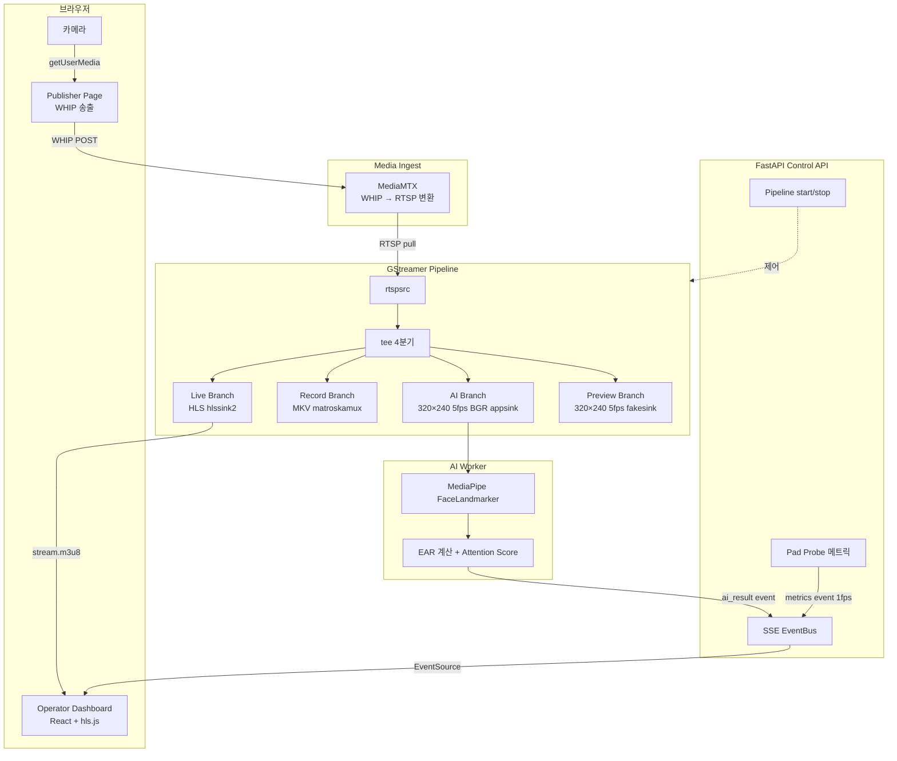

# Live Class Pipeline Lab

> GStreamer 기반 실시간 강의 스트림 분기 파이프라인 — 기술 실증 프로젝트

브라우저에서 수신한 WebRTC 스트림을 실시간으로 4개 branch로 분기하여 HLS 송출 · 녹화 · AI 집중도 분석을 동시에 처리하는 파이프라인을 직접 구축하고 검증합니다.

---

## 아키텍처



---

## 핵심 검증 내용

1. **GStreamer tee** — 단일 입력을 4개 branch로 무손실 분기
2. **백프레셔 격리** — AI branch `leaky=downstream`으로 느린 처리가 live branch에 영향 없음
3. **MediaPipe LIVE_STREAM** — 5fps 실시간 얼굴 랜드마크 추출 + EAR 기반 집중도 산출
4. **HLS-AI 동기화** — `wall_clock_ms` + hls.js `FRAG_CHANGED`로 재생 시간 ±500ms 매핑
5. **전체 스택 Docker화** — GStreamer + FastAPI + React + MediaMTX + Caddy TLS

---

## 실험 결과 요약

| 항목 | 결과 |
|------|------|
| AI branch FPS | 5fps (videorate 제한, 설계 목표 달성) |
| live branch FPS | 30fps (AI branch와 독립) |
| HLS 재생 지연 | ~6초 (2초 × 3 세그먼트) |
| EAR 측정 (정면 얼굴) | 0.16~0.18 (정규화 좌표계) |
| attention_score 범위 | 0.0~1.0 정상 출력 |

> 상세: [docs/experiment-02-e2e-test.md](docs/experiment-02-e2e-test.md) · [docs/05-results.md](docs/05-results.md)

---

## 실행 방법

### 로컬 (Docker Compose)

```bash
docker compose -f infra/compose/docker-compose.local.yml up --build
# Dashboard: http://localhost:3000
# API:       http://localhost:8000
# MediaMTX:  rtsp://localhost:8554/room1
```

### 서버 배포 (Caddy + TLS)

```bash
cp infra/compose/.env.server.example infra/compose/.env.server
# .env.server에 DOMAIN=your-domain.com 설정 후:
DOMAIN=your-domain.com docker compose \
  -f infra/compose/docker-compose.server.yml up -d --build
```

### 로컬 개발 (파일 소스)

```bash
# MediaMTX
bash scripts/start-mediamtx.sh

# GStreamer HLS (파일 소스)
bash media/gstreamer/pipelines/07-hls-branch.sh

# React 대시보드
cd apps/dashboard && npm run dev
```

---

## 대시보드 사용법

### 화면 구성

대시보드는 두 개의 탭으로 이루어져 있습니다.

#### Dashboard 탭 (`http://localhost:3000`)

| 구성 요소 | 설명 |
|-----------|------|
| **SSE 연결 상태** | 우측 상단 배지 — `● SSE 연결됨` / `○ 연결 끊김` |
| **Pipeline Control** | Start / Stop 버튼으로 GStreamer 파이프라인 제어 |
| **Branch Status Cards** | live · record · ai · preview 4개 branch의 현재 FPS · 드롭 프레임 수 실시간 표시 |
| **FPS Chart** | 시계열 Recharts 그래프 — 최근 60초 branch별 FPS 추이 |
| **HLS Player** | hls.js 기반 플레이어 — `FRAG_CHANGED` 이벤트로 AI 결과와 시간 동기화 |
| **AI Result Panel** | HLS 재생 시점 기준 ±500ms 창에서 매핑된 집중도 표시 |

#### AI Result Panel 세부

```
Attention Score  ████████░░ 80 %   (초록≥70 / 노랑≥40 / 빨강<40)
Left EAR   0.17     Right EAR  0.18
정면 응시  ✓ / ✗
얼굴 미감지 시 "얼굴을 인식할 수 없습니다" 문구 표시
```

#### 송출 탭

브라우저 카메라를 WHIP 프로토콜로 MediaMTX에 직접 전송합니다.

| 항목 | 값 |
|------|-----|
| 해상도 | 1280 × 720, 30fps |
| 프로토콜 | WebRTC WHIP POST → `VITE_MEDIAMTX_URL/room1/whip` |
| 오디오 | 비활성화 (영상만 전송) |

---

### 엔드-투-엔드 테스트 순서

```text
1. docker compose up 으로 스택 기동 확인
   → mediamtx / api / dashboard 모두 healthy

2. http://localhost:3000 → [송출] 탭
   → "송출 시작" 클릭
   → 카메라 권한 허용 → "● 송출 중 — room1" 표시 확인

3. [Dashboard] 탭 → Pipeline Control → "Start" 클릭
   → SSE 배지가 "● SSE 연결됨"으로 전환
   → Branch Status Cards에 FPS 수치 표시 시작

4. 약 6초 후 HLS 플레이어에서 영상 재생 시작
   (3 × 2초 세그먼트 버퍼)

5. AI Result Panel에서 집중도 점수 및 EAR 값 실시간 확인
```

> WHIP 송출 없이 파일 소스로 테스트하려면:
> ```bash
> # API 컨테이너 내부에서
> curl -X POST http://localhost:8000/pipeline/start \
>   -H "Content-Type: application/json" \
>   -d '{"source": "media/sample.mp4"}'
> ```

---

## 태스크 진행 현황

| Phase | 범위 | 상태 |
|-------|------|------|
| Phase 1 | GStreamer 파이프라인 기초 (T01~T06) | ✅ 완료 |
| Phase 2 | FastAPI + Python GI 연동 (T07~T10) | ✅ 완료 |
| Phase 3 | React Dashboard + SSE (T11~T15) | ✅ 완료 |
| Phase 4 | MediaPipe AI 분석 (T16~T20) | ✅ 완료 |
| Phase 5 | MediaMTX WHIP 연동 (T21~T24) | ✅ 완료 |
| Phase 6 | Docker 배포 (T25~T29) | ✅ 완료 |
| Phase 7 | 측정 및 보고서 (T30~T31) | ✅ 완료 |

---

## 기술 스택

| 레이어 | 기술 |
|--------|------|
| 미디어 파이프라인 | GStreamer 1.x, tee, hlssink2, matroskamux, appsink |
| 미디어 서버 | MediaMTX (WHIP ingest, RTSP relay) |
| AI 분석 | Google MediaPipe FaceLandmarker, EAR 알고리즘 |
| 백엔드 | FastAPI, uvicorn, Python GI 바인딩, SSE EventBus |
| 프론트엔드 | React 18, Vite, TypeScript, Tailwind CSS, hls.js, Recharts |
| 인프라 | Docker Compose, Caddy (자동 TLS), Nginx (SPA 서빙) |

---

> 관련 이슈: [태스크 로드맵 #2](https://github.com/Yelihi/live-class-pipeline/issues/2)
