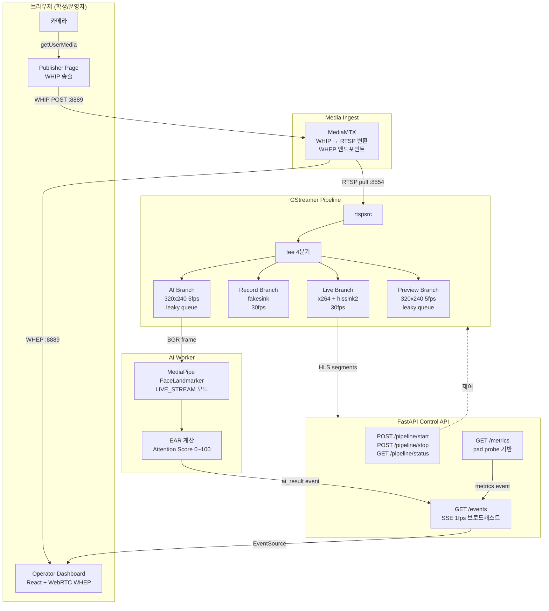

# Live Class Pipeline Lab

> **GStreamer 기반 실시간 라이브 강의 파이프라인 — 기술 실증 프로젝트**
>
> 브라우저 카메라 영상을 수신해 HLS 송출 · 파일 녹화 · AI 집중도 분석을 **동시에** 처리하는 파이프라인을 직접 구축하고,
> GStreamer(C 네이티브)와 OpenCV+Python 스레딩의 성능을 **실측 데이터**로 비교한 실험 레포입니다.

---

## 목차

1. [이 프로젝트가 만들어진 이유](#1-이-프로젝트가-만들어진-이유)
2. [핵심 개념 — GStreamer가 무엇인가](#2-핵심-개념--gstreamer가-무엇인가)
3. [전체 아키텍처](#3-전체-아키텍처)
4. [실측 결과 요약](#4-실측-결과-요약)
5. [빠른 시작 (Docker Compose)](#5-빠른-시작-docker-compose)
6. [GStreamer 성능 실험 (단계별 테스트 가이드)](#6-gstreamer-성능-실험-단계별-테스트-가이드)
7. [GStreamer vs OpenCV 비교 실험](#7-gstreamer-vs-opencv-비교-실험)
8. [대시보드 사용법](#8-대시보드-사용법)
9. [디렉토리 구조](#9-디렉토리-구조)
10. [기술 스택](#10-기술-스택)
11. [개발 이력 및 태스크 현황](#11-개발-이력-및-태스크-현황)

---

## 1. 이 프로젝트가 만들어진 이유

라이브 강의 플랫폼에서 학생 카메라 영상을 받으면 동시에 여러 가지 처리가 필요합니다.

```
학생 카메라 영상 (30fps)
  ├─ 수업 참여자에게 실시간 재전송  (live, 30fps — 지연 최소화)
  ├─ 강의 녹화 파일 저장           (record, 30fps — 무손실)
  ├─ AI 집중도 분석                (ai, 5fps — AI가 느려도 괜찮음)
  └─ 운영자 모니터링 미리보기      (preview, 5fps)
```

이를 **Python 코드**로 단순하게 구현하면 AI 처리가 느릴 때 전체 영상이 멈추는 문제가 생깁니다.
GStreamer를 사용하면 각 경로를 C 레벨에서 독립 처리하여 AI가 아무리 느려도 live 스트림에 영향이 없습니다.

**이 프로젝트의 질문**: "GStreamer를 쓰는 것이 실제로 얼마나 더 좋은가?" → 수치로 직접 측정해 답합니다.

---

## 2. 핵심 개념 — GStreamer가 무엇인가

> React를 아신다면: GStreamer의 element는 React 컴포넌트처럼 조합해서 사용합니다.
> `<VideoSource> → <Tee> → <HlsSink>` 처럼 연결하면 영상이 흘러갑니다.

```
[rtspsrc] → [decodebin] → [videoconvert] → [tee]
                                              ├─ [queue leaky] → [videorate 5fps] → [appsink]  ← AI 처리
                                              ├─ [queue]       → [x264enc] → [hlssink2]        ← HLS 송출
                                              ├─ [queue]       → [fakesink]                    ← 녹화
                                              └─ [queue leaky] → [videorate 5fps] → [fakesink] ← 미리보기
```

| GStreamer 개념 | 설명 |
|--------------|------|
| **element** | 영상을 처리하는 단위 (`videoscale`, `x264enc` 등) |
| **tee** | 단일 스트림을 여러 갈래로 분기하는 splitter |
| **queue leaky=downstream** | AI branch가 느려도 오래된 프레임을 버리고 live는 계속 진행 |
| **appsink** | Python으로 프레임을 꺼내올 수 있는 출구 |
| **PTS (Presentation Timestamp)** | 각 프레임의 정확한 재생 시각 — 타이밍 기준 |

---

## 3. 전체 아키텍처



### 포트 구성

| 포트 | 서비스 | 용도 |
|------|--------|------|
| **3000** | Dashboard (Nginx) | React 대시보드 |
| **8000** | FastAPI | 파이프라인 제어 + SSE 메트릭 |
| **8554** | MediaMTX RTSP | GStreamer rtspsrc pull |
| **8889** | MediaMTX WebRTC | 브라우저 WHIP 송출 / WHEP 수신 |
| **9997** | MediaMTX API | 경로 목록 및 상태 확인 |

---

## 4. 실측 결과 요약

### 4-A. 단일 스트림 — 브라우저 WHIP 카메라 입력

| Branch | 목표 FPS | 실측 FPS | 비고 |
|--------|---------|---------|------|
| live    | 30fps | **30.3fps** | 오차 1% 이내 |
| record  | 30fps | **30.3fps** | 오차 1% 이내 |
| ai      | 5fps  | **5.0fps**  | leaky queue로 live 영향 없음 |
| preview | 5fps  | **5.0fps**  | leaky queue로 live 영향 없음 |

> 측정일: 2026-05-22 / 입력: 브라우저 WHIP → MediaMTX → GStreamer

### 4-B. 다중 스트림 — GStreamer vs OpenCV Python 비교

> 측정일: 2026-05-27 / 입력: `gen-streams.sh` (1280×720 30fps 합성 스트림)

| 구현 | N=1 avg | N=1 지터(σ) | N=4 avg | N=4 지터(σ) |
|------|---------|------------|---------|------------|
| **GStreamer** | **30.0fps** | **σ=0.00** | **30.0fps** | **σ=0.00** |
| OpenCV Python | 31.1fps | σ=3.82 (max 48.7) | 30.5fps | σ=2.46 (max 43.7) |

**핵심 차이점**: avg fps가 비슷해도 OpenCV는 Python GIL burst로 인해 순간 최대 48.7fps가 발생합니다.
GStreamer는 C 레벨 PTS 기반으로 완벽하게 일정한 타이밍(σ=0)을 유지합니다.

### 4-C. Preview 지연 방식 비교

| 방식 | 지연 |
|------|------|
| HLS (이전 구현) | ~6초 (2초 × 3 세그먼트 버퍼링) |
| **WebRTC WHEP (현재)** | **< 100ms** (MediaMTX 내장) |

---

## 5. 빠른 시작 (Docker Compose)

### 사전 요구사항

```bash
docker --version       # 20.x 이상
docker compose version # v2.x 이상
```

### 실행

```bash
# 1. 저장소 클론
git clone https://github.com/Yelihi/live-class-pipeline.git
cd live-class-pipeline

# 2. 전체 스택 실행 (GStreamer 버전)
docker compose -f infra/compose/docker-compose.local.yml up --build -d

# 3. 서비스 확인
curl http://localhost:8000/health   # → {"status":"ok"}
curl http://localhost:8000/metrics  # → {"rooms":{}, "aggregate":{}}
```

### 화면 접속

| URL | 설명 |
|-----|------|
| http://localhost:3000 | 운영자 대시보드 |
| http://localhost:8000/docs | FastAPI Swagger UI |

### 브라우저로 카메라 송출 + 파이프라인 시작

```
1. http://localhost:3000 접속
2. [송출] 탭 → "송출 시작" 클릭 → 카메라 권한 허용
3. [Dashboard] 탭 → "Start Pipeline" 클릭
4. Branch Status Cards에 FPS 수치 표시 시작
5. WHEP Preview에서 실시간 영상 확인 (< 100ms 지연)
```

---

## 6. GStreamer 성능 실험 (단계별 테스트 가이드)

> 브라우저 카메라 없이 **합성 스트림**으로 테스트합니다. ffmpeg가 로컬에 설치되어 있어야 합니다.

### 사전 준비

```bash
# ffmpeg 설치 확인
ffmpeg -version

# macOS
brew install ffmpeg

# Ubuntu
sudo apt-get install ffmpeg
```

### Step 1. Docker 스택 실행

```bash
docker compose -f infra/compose/docker-compose.local.yml up --build -d

# 모든 서비스가 Up 상태인지 확인
docker compose -f infra/compose/docker-compose.local.yml ps
```

예상 출력:
```
NAME                  STATUS
compose-api-1         Up
compose-dashboard-1   Up
compose-mediamtx-1    Up
```

### Step 2. 합성 RTSP 스트림 생성

```bash
# 터미널 A: 1개 합성 스트림 (1280×720, 30fps)
bash scripts/gen-streams.sh 1 rtsp://localhost:8554

# 4개 동시 스트림
bash scripts/gen-streams.sh 4 rtsp://localhost:8554
```

출력 예시:
```
[gen-streams] room1 → rtsp://localhost:8554/room1 (PID 12345)
[gen-streams] Streaming 1 room(s). Press Ctrl+C to stop.
```

### Step 3. GStreamer 파이프라인 시작

> **주의**: `/pipeline/start`는 이미 실행 중인 파이프라인이 있으면 `{"error": "이미 실행 중"}`을 반환합니다.
> 새로운 룸 구성으로 시작하려면 반드시 `/pipeline/stop`으로 먼저 중지한 뒤 다시 시작하세요.

```bash
# 터미널 B: 단일 룸
curl -s -X POST "http://localhost:8000/pipeline/start?rooms=room1" | python3 -m json.tool
# → {"state": "started", "rooms": ["room1"]}

# 4개 룸으로 전환 시: 기존 파이프라인 중지 후 재시작
curl -s -X POST http://localhost:8000/pipeline/stop
curl -s -X POST "http://localhost:8000/pipeline/start?rooms=room1,room2,room3,room4" | python3 -m json.tool
# → {"state": "started", "rooms": ["room1", "room2", "room3", "room4"]}
```

### Step 4. 실시간 메트릭 확인

```bash
# 현재 상태 스냅샷
curl -s http://localhost:8000/metrics | python3 -m json.tool
```

응답 예시 (N=4 실행 중):
```json
{
  "rooms": {
    "room1": {
      "live":    {"fps": 30.0, "frame_count": 900},
      "record":  {"fps": 30.0, "frame_count": 900},
      "ai":      {"fps":  5.0, "frame_count": 150},
      "preview": {"fps":  5.0, "frame_count": 150}
    },
    "room2": { ... },
    "room3": { ... },
    "room4": { ... }
  },
  "aggregate": {
    "live":    {"avg_fps": 30.0, "total_frames": 3600},
    "ai":      {"avg_fps":  5.0, "total_frames":  600}
  }
}
```

```bash
# SSE 이벤트 실시간 스트리밍
curl -N http://localhost:8000/events
# → data: {"type":"metrics","data":{...},"timestamp":1716784800.0}
# → data: {"type":"metrics","data":{...},"timestamp":1716784801.0}
```

### Step 5. 30초 측정 및 CSV 저장

```bash
# N=1 측정
curl -s -X POST "http://localhost:8000/pipeline/start?rooms=room1"
bash scripts/collect-metrics.sh http://localhost:8000 30 results/my_gst_n1.csv
curl -s -X POST http://localhost:8000/pipeline/stop

# N=4 측정
curl -s -X POST "http://localhost:8000/pipeline/start?rooms=room1,room2,room3,room4"
bash scripts/collect-metrics.sh http://localhost:8000 30 results/my_gst_n4.csv
curl -s -X POST http://localhost:8000/pipeline/stop
```

CSV 예시:
```
timestamp,live_fps,record_fps,ai_fps,preview_fps
2026-05-27T04:51:34Z,30.0,30.0,5.0,5.0
2026-05-27T04:51:35Z,30.0,30.0,5.0,5.0
...
```

### Step 6. 결과 분석

```bash
python3 - results/my_gst_n4.csv <<'EOF'
import csv, sys

rows = list(csv.DictReader(open(sys.argv[1])))
print(f"샘플 수: {len(rows)}개")
for col in ["live_fps", "record_fps", "ai_fps", "preview_fps"]:
    vals = [float(r[col]) for r in rows if float(r[col]) > 0]
    if not vals:
        continue
    avg = sum(vals) / len(vals)
    std = (sum((v - avg) ** 2 for v in vals) / len(vals)) ** 0.5
    print(f"  {col:<14}: avg={avg:.2f}  σ={std:.2f}  min={min(vals):.1f}  max={max(vals):.1f}")
EOF
```

---

## 7. GStreamer vs OpenCV 비교 실험

> **이 실험의 목적**: "GStreamer가 없으면 어떻게 되는가?"를 수치로 확인합니다.
>
> 두 버전은 동일한 4-branch 출력을 내지만 내부 구현이 다릅니다.

### 두 구현의 핵심 차이

| 항목 | GStreamer | OpenCV + Python threads |
|------|----------|------------------------|
| 언어 | C (GLib 스레드) | Python (GIL 제약) |
| 프레임 전달 | zero-copy (참조 카운팅) | `frame.copy()` × 4 × N |
| 5fps 제어 | `videorate` C 엘리먼트 | `time.monotonic()` 수동 샘플링 |
| AI branch 격리 | `leaky=downstream` C 큐 | `Python Queue(maxsize=5)` + GIL 경합 |
| RTSP 재연결 | `rtspsrc` 자동 처리 | 수동 재연결 루프 필요 |
| fps 타이밍 기준 | PTS (하드웨어 클럭) | wall clock (Python 오버헤드 포함) |

### Step 1. OpenCV 버전으로 전환

```bash
# 1. GStreamer 파이프라인 중지
curl -s -X POST http://localhost:8000/pipeline/stop

# 2. OpenCV 이미지 빌드 및 교체
#    (기존 GStreamer 컨테이너를 OpenCV 컨테이너로 오버라이드)
docker compose \
  -f infra/compose/docker-compose.local.yml \
  -f infra/compose/docker-compose.opencv.yml \
  up --build api -d

# 3. 헬스체크 — 같은 엔드포인트를 그대로 사용
curl http://localhost:8000/health   # → {"status":"ok"}
curl http://localhost:8000/metrics  # → {"rooms":{}, "aggregate":{}}
```

> `docker-compose.opencv.yml`은 `api` 서비스의 Dockerfile만 교체합니다.
> 포트·볼륨·MediaMTX는 변경 없이 그대로 사용됩니다.

### Step 2. 동일한 실험 반복

```bash
# gen-streams.sh는 그대로 사용
bash scripts/gen-streams.sh 1 rtsp://localhost:8554 &

# OpenCV 파이프라인 시작 (엔드포인트 동일)
curl -s -X POST "http://localhost:8000/pipeline/start?rooms=room1"

# 30초 측정
bash scripts/collect-metrics.sh http://localhost:8000 30 results/my_opencv_n1.csv

# 중지
curl -s -X POST http://localhost:8000/pipeline/stop
pkill -f "ffmpeg.*rtsp://localhost:8554/room"
```

```bash
# N=4 반복
bash scripts/gen-streams.sh 4 rtsp://localhost:8554 &
sleep 5
curl -s -X POST "http://localhost:8000/pipeline/start?rooms=room1,room2,room3,room4"
bash scripts/collect-metrics.sh http://localhost:8000 30 results/my_opencv_n4.csv
curl -s -X POST http://localhost:8000/pipeline/stop
pkill -f "ffmpeg.*rtsp://localhost:8554/room"
```

### Step 3. 두 버전 비교

```bash
python3 - results/my_gst_n4.csv results/my_opencv_n4.csv <<'EOF'
import csv, sys

for path in sys.argv[1:]:
    rows = list(csv.DictReader(open(path)))
    label = path.split("/")[-1].replace(".csv", "")
    print(f"\n=== {label} (n={len(rows)}) ===")
    for col in ["live_fps", "ai_fps"]:
        vals = [float(r[col]) for r in rows if float(r[col]) > 0]
        if not vals:
            continue
        avg = sum(vals) / len(vals)
        std = (sum((v - avg) ** 2 for v in vals) / len(vals)) ** 0.5
        print(f"  {col:<14}: avg={avg:.2f}  σ={std:.2f}  min={min(vals):.1f}  max={max(vals):.1f}")
EOF
```

예상 출력:
```
=== my_gst_n4 (n=20) ===
  live_fps      : avg=30.00  σ=0.00  min=30.0  max=30.0  ← 완벽하게 일정
  ai_fps        : avg=5.00   σ=0.00  min=5.0   max=5.0

=== my_opencv_n4 (n=30) ===
  live_fps      : avg=30.49  σ=2.46  min=30.0  max=43.7  ← Python GIL burst
  ai_fps        : avg=5.00   σ=0.00  min=5.0   max=5.0
```

**수치 해석**:
- GStreamer σ=0: C 레벨 PTS 기반 측정이므로 타이밍이 항상 일정
- OpenCV max=43.7fps: 실제 소스(30fps)를 초과하는 값이 발생 → Python 스레드가 GIL을 반납받는 순간 큐에 쌓인 프레임을 burst로 소비하는 현상
- 이 지터는 HLS 세그먼트 경계 불규칙, MKV 가변 프레임레이트, AI 타임스탬프 왜곡으로 이어짐

### Step 4. GStreamer로 원복

```bash
docker compose -f infra/compose/docker-compose.local.yml up api -d --force-recreate
curl http://localhost:8000/health  # → {"status":"ok"}
```

### 실제 측정 데이터

이 레포에서 실행한 측정 결과가 [`results/`](results/) 디렉토리에 있습니다.

| 파일 | 샘플 수 | live avg | live σ |
|------|---------|----------|--------|
| `results/gst_n1.csv` | 30 | **30.00fps** | **0.00** |
| `results/gst_n4.csv` | 20 | **30.00fps** | **0.00** |
| `results/opencv_n1.csv` | 44 | 31.06fps | 3.82 |
| `results/opencv_n4.csv` | 30 | 30.49fps | 2.46 |

> 상세 분석: [docs/05-results.md](docs/05-results.md)  
> 실험 이슈: [#36 T-32 비교 실험](https://github.com/Yelihi/live-class-pipeline/issues/36)

---

## 8. 대시보드 사용법

### Dashboard 탭

| 구성 요소 | 설명 |
|-----------|------|
| **SSE 연결 상태** | 우측 상단 배지 — `● SSE 연결됨` / `○ 연결 끊김` |
| **Pipeline Control** | Start / Stop 버튼으로 GStreamer 파이프라인 제어 |
| **Branch Status Cards** | live · record · ai · preview 4개 branch의 현재 avg_fps 실시간 표시 |
| **FPS Chart** | 시계열 Recharts 그래프 — 최근 60초 branch별 FPS 추이 |
| **WHEP Preview** | WebRTC 실시간 영상 (< 100ms 지연) |
| **AI Result Panel** | 얼굴 감지 여부 · EAR · 집중도 점수(0~100) |

```
Attention Score  ████████░░ 80    (초록≥70 / 노랑≥40 / 빨강<40)
Left EAR   0.17     Right EAR  0.18
정면 응시  ✓
```

### 송출 탭

브라우저 카메라를 WHIP 프로토콜로 MediaMTX에 직접 전송합니다.

```
1. [송출] 탭 → "송출 시작" 클릭
2. 카메라 접근 권한 허용
3. "● 송출 중 — room1" 표시 확인
4. [Dashboard] 탭에서 WHEP Preview 영상 확인 (< 2초 내 연결)
```

> 탭을 전환해도 WebRTC 연결이 끊기지 않습니다 (CSS visibility로 처리).

### API 직접 호출

```bash
# 파이프라인 시작 (단일 룸)
curl -X POST "http://localhost:8000/pipeline/start?rooms=room1"

# 파이프라인 시작 (N개 룸)
curl -X POST "http://localhost:8000/pipeline/start?rooms=room1,room2,room3,room4"

# 상태 확인
curl http://localhost:8000/pipeline/status

# 메트릭 스냅샷
curl http://localhost:8000/metrics

# 파이프라인 중지
curl -X POST http://localhost:8000/pipeline/stop

# HLS 플레이리스트 (파이프라인 시작 후)
curl http://localhost:8000/hls/room1/stream.m3u8
```

---

## 9. 디렉토리 구조

```
live-class-pipeline-lab/
├── apps/
│   ├── control-api/            # GStreamer 파이프라인 FastAPI (Python + GI 바인딩)
│   │   └── src/
│   │       ├── services/
│   │       │   ├── pipeline_manager.py  # N룸 GStreamer 파이프라인 관리
│   │       │   ├── metrics_collector.py # per-room pad probe 메트릭
│   │       │   ├── ai_worker.py         # MediaPipe FaceLandmarker
│   │       │   ├── attention_analyzer.py# EAR 계산 + 집중도 산출
│   │       │   └── event_bus.py         # asyncio SSE 브로드캐스트
│   │       └── routes/
│   │           ├── pipeline.py  # POST /pipeline/start?rooms=...
│   │           ├── metrics.py   # GET /metrics
│   │           └── events.py    # GET /events (SSE)
│   │
│   ├── opencv-pipeline/        # OpenCV+Python 파이프라인 (GStreamer 비교군)
│   │   └── src/
│   │       ├── main.py          # FastAPI (동일 엔드포인트)
│   │       ├── pipeline.py      # RoomPipeline: 5 threads per room
│   │       ├── attention_analyzer.py
│   │       └── event_bus.py
│   │
│   └── dashboard/              # React 대시보드
│       └── src/
│           ├── pages/DashboardPage.tsx
│           ├── widgets/
│           │   ├── WhepPlayer.tsx        # WebRTC WHEP 실시간 프리뷰
│           │   ├── BranchStatusCard.tsx  # branch별 avg_fps 표시
│           │   ├── FpsChart.tsx          # 시계열 차트
│           │   └── AIResultPanel.tsx     # 집중도 패널
│           └── features/metrics-subscribe/
│               ├── usePipelineEvents.ts  # SSE 구독
│               └── useFpsHistory.ts      # FPS 히스토리 버퍼
│
├── infra/
│   ├── compose/
│   │   ├── docker-compose.local.yml  # 로컬 개발 스택
│   │   ├── docker-compose.server.yml # 서버 배포 (Caddy TLS)
│   │   └── docker-compose.opencv.yml # OpenCV api 오버라이드
│   └── docker/
│       ├── gstreamer.Dockerfile  # Ubuntu 22.04 + GStreamer 1.20 + MediaPipe
│       ├── opencv.Dockerfile     # python:3.11-slim + OpenCV + MediaPipe (GStreamer 없음)
│       ├── control-api.Dockerfile
│       └── dashboard.Dockerfile
│
├── scripts/
│   ├── gen-streams.sh        # N개 합성 RTSP 스트림 생성 (ffmpeg testsrc2)
│   └── collect-metrics.sh    # 30초 FPS 측정 → CSV 저장
│
├── media/
│   ├── mediamtx/mediamtx.yml # MediaMTX 설정 (room1~8 경로 정의)
│   └── models/               # MediaPipe face_landmarker.task (Dockerfile 빌드 시 포함)
│
├── results/                  # 실험 측정 CSV 데이터
│   ├── gst_n1.csv    gst_n4.csv
│   └── opencv_n1.csv opencv_n4.csv
│
└── docs/
    ├── 05-results.md          # 전체 측정 결과 및 분석
    └── development-history.md # 개발 이력 (T-00 ~ T-38)
```

---

## 10. 기술 스택

| 레이어 | 기술 | 선택 이유 |
|--------|------|----------|
| 미디어 파이프라인 | **GStreamer 1.20** | C 레벨 zero-copy, tee + leaky queue, PTS 기반 타이밍 |
| 비교 파이프라인 | **OpenCV + Python threads** | GIL 경합 + frame.copy() 오버헤드 측정 대상 |
| 미디어 서버 | **MediaMTX** | WHIP(브라우저 송출) + RTSP(GStreamer pull) + WHEP(WebRTC 수신) 통합 |
| AI 분석 | **MediaPipe FaceLandmarker** | LIVE_STREAM 비동기 모드, EAR 기반 집중도 |
| 백엔드 | **FastAPI + uvicorn** | SSE EventBus, asyncio ↔ GLib 스레드 브리지 |
| 프론트엔드 | **React 18 + Vite + TypeScript** | SSE 구독, WebRTC WHEP 수신, Recharts 차트 |
| 인프라 | **Docker Compose** | 로컬/서버 동일 환경, OpenCV 비교군 오버라이드 |

---

## 11. 개발 이력 및 태스크 현황

| Phase | 내용 | 상태 |
|-------|------|------|
| Phase 0 (T-00~07) | GStreamer 개발환경, tee 4분기, leaky queue 실험 | ✅ |
| Phase 1 (T-08~10) | FastAPI 제어 API, pad probe 메트릭, SSE EventBus | ✅ |
| Phase 2 (T-11~15) | React 대시보드, FPS 차트, HLS 플레이어 | ✅ |
| Phase 3 (T-16~20) | MediaPipe LIVE_STREAM, EAR 집중도, SSE ai_result | ✅ |
| Phase 4 (T-21~23) | MediaMTX WHIP 브라우저 송출, RTSP pull 연동 | ✅ |
| Phase 5 (T-24~29) | Docker Compose, Caddy TLS, 서버 배포 준비 | ✅ |
| Phase 6 (T-30~31) | 측정 스크립트, 결과 문서 | ✅ |
| Phase 7 (fix)     | WHEP 프리뷰 전환 (HLS → WebRTC < 100ms) | ✅ |
| **Phase 8 (T-33~38)** | **GStreamer vs OpenCV 다중 스트림 비교 실험** | ✅ |

> 전체 개발 이력: [docs/development-history.md](docs/development-history.md)  
> 태스크 이슈: [#36](https://github.com/Yelihi/live-class-pipeline/issues/36) · [#37](https://github.com/Yelihi/live-class-pipeline/issues/37) · [#38](https://github.com/Yelihi/live-class-pipeline/issues/38) · [#39](https://github.com/Yelihi/live-class-pipeline/issues/39) · [#40](https://github.com/Yelihi/live-class-pipeline/issues/40) · [#41](https://github.com/Yelihi/live-class-pipeline/issues/41) · [#42](https://github.com/Yelihi/live-class-pipeline/issues/42)
